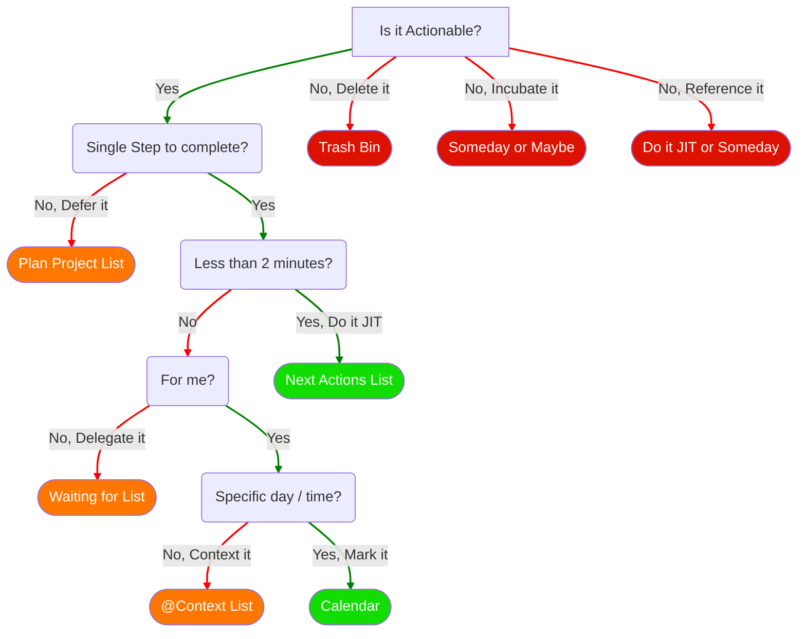

---
description:
tags:
  - gtd
  - context
  - context/time
  - context/place
  - context/person
  - context/tool
  - context/energy
created: 2025-05-18
modified: 2025-05-18
---

# GTD  Workflow

```mermaid
flowchart TD

A[Is it Actionable?] -->|Yes| B(Single Step to complete?)
A --> |No, Delete it| Delete([Trash Bin])
A --> |No, Incubate it| Defer([Someday or Maybe])
A --> |No, Reference it| Reference([Do it JIT or Someday])

B --> |No, Defer it| Plan([Plan Project List])
B --> |Yes| C(Less than 2 minutes?)

C --> |No| D(For me?)
C --> |Yes, Do it JIT| Do([Next Actions List])

D --> |No, Delegate it| Wait([Waiting for List])
D --> |Yes| E(Specific day / time?)

E --> |No, Context it| Context(["@Context" List])
E --> |Yes, Mark it| Calendar([Calendar])

style Delete fill:#d10,color:#fff
style Defer fill:#d10,color:#fff
style Reference fill:#d10,color:#fff
style Plan fill:#f70,color:#fff
style Wait fill:#f70,color:#fff
style Context fill:#f70,color:#fff
style Do fill:#1d0,color:#fff
style Calendar fill:#1d0,color:#fff

linkStyle 0,5,7,9,11 stroke-width:2px,fill:none,stroke:green;
linkStyle 1,2,3,4,6,8,10 stroke-width:2px,fill:none,stroke:red;

%% class Wait,Plan,Defer,Reference,Do,Context,Calendar,Delete internal-link

```

