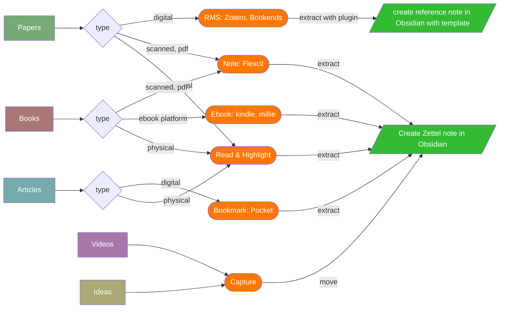

---
description:
created: 2025-05-18
modified: 2025-05-18
---

```mermaid
flowchart LR

paper[Papers] --> paper_type{type}
book[Books] --> book_type{type}
article[Articles] --> article_type{type}
video[Videos] --> capture([Capture])
idea[Ideas] --> capture

capture --> |move| l_note
 
paper_type --> |digital| rms([RMS: Zotero, Bookends])
paper_type --> |scanned, pdf| ipad([Note: Flexcil])
paper_type --> |physical| note([Read & Highlight])

rms --> |extract with plugin| rms_note[/create reference note in Obsidian with template/]

ipad --> |extract| l_note[/Create Zettel note in Obsidian/]

note --> |extract| l_note

book_type --> |scanned, pdf| ipad
book_type --> |ebook platform| ebook([Ebook: kindle, millie])
book_type --> |physical| note

ebook --> |extract| l_note

article_type --> |digital| bookmark([Bookmark: Pocket])
article_type --> |physical| note

bookmark --> |extract| l_note

style idea fill:#aa7,color:#fff
style article fill:#7aa,color:#fff
style video fill:#a7a,color:#fff
style paper fill:#7a7,color:#fff
style book fill:#a77,color:#fff

style rms fill:#f70,color:#fff
style ipad fill:#f70,color:#fff
style ebook fill:#f70,color:#fff
style note fill:#f70,color:#fff
style bookmark fill:#f70,color:#fff
style capture fill:#f70,color:#fff

style l_note fill:#3b3,color:#fff
style rms_note fill:#3b3,color:#fff
```