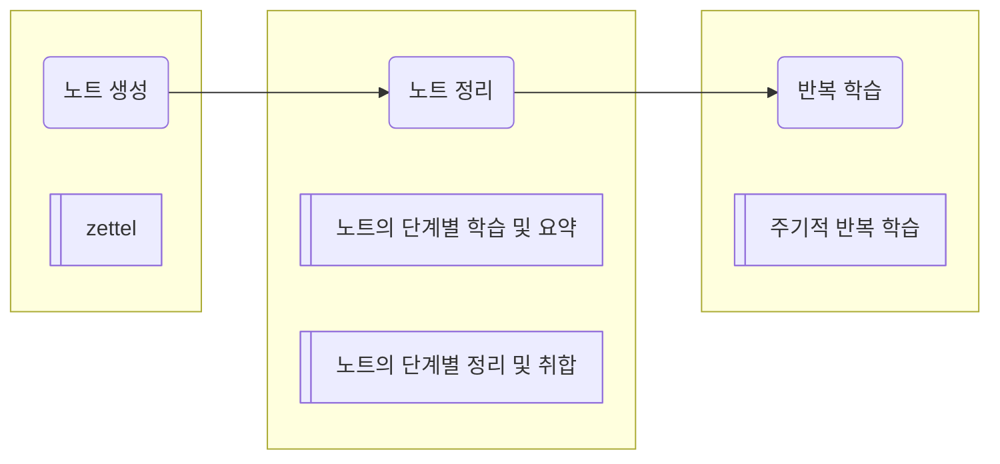

# Info
- My Workflow ^bb9ac3
	- [[markdown을 이용한 노트와 태스크 그리고 일정 관리]]
	- [[지식 노트와 아이디어 노트는 정리법이 달라야한다]]
	- [[노트의 단계별 학습 및 요약]]
		- 개별 노트 중심 정리
	- [[노트의 단계별 정리 및 취합]]
		- 노트간의 정리
	- [[주기적 반복 학습]]

# Diagram

